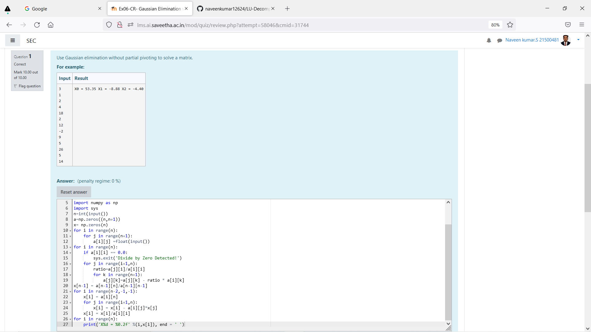

# Gaussian Elimination with partial pivoting

## AIM:
To write a program to find the Gaussian Elimination with partial pivoting of a matrix.

## Equipments Required:
1. Hardware – PCs
2. Anaconda – Python 3.7 Installation / Moodle-Code Runner

## Algorithm
1. import numpy and use sys to find the errors.
2. get input matrices from user.
3. calculate the values by using loops and libraries.
4. print it,as needed by user.

## Program:
```
/*
Program to find the Gaussian Elimination with partial pivoting of a matrix.
Developed by: Naveenkumar.S
RegisterNumber: 21500481
*/
import numpy as np
import sys
n=int(input())
a=np.zeros((n,n+1))
x= np.zeros(n)
for i in range(n):
    for j in range(n+1):
        a[i][j] =float(input())
for i in range(n):
    if a[i][i] == 0.0:
        sys.exit('Divide by Zero Detected!')
    for j in range(i+1,n):
        ratio=a[j][i]/a[i][i]
        for k in range(n+1):
            a[j][k]=a[j][k] - ratio * a[i][k]
x[n-1] = a[n-1][n]/a[n-1][n-1]
for i in range(n-2,-1,-1):
    x[i] = a[i][n]
    for j in range(i+1,n):
        x[i] = x[i] - a[i][j]*x[j]
    x[i] = x[i]/a[i][i]
for i in range(n):
    print('X%d = %0.2f' %(i,x[i]), end = ' ')
```

## Output:



## Result:
Thus the program to find the Gaussian Elimination with partial pivoting of a matrix is written and verified using python programming.

